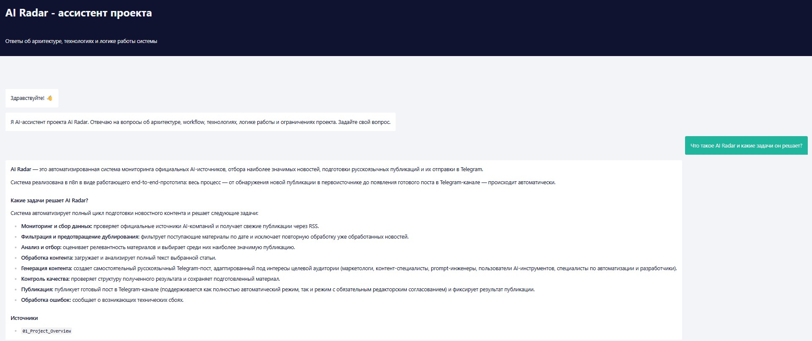
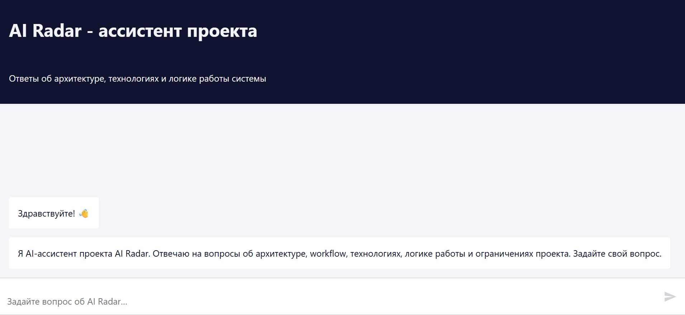
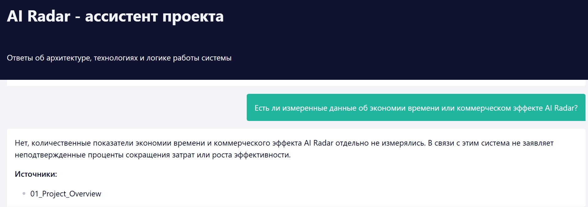
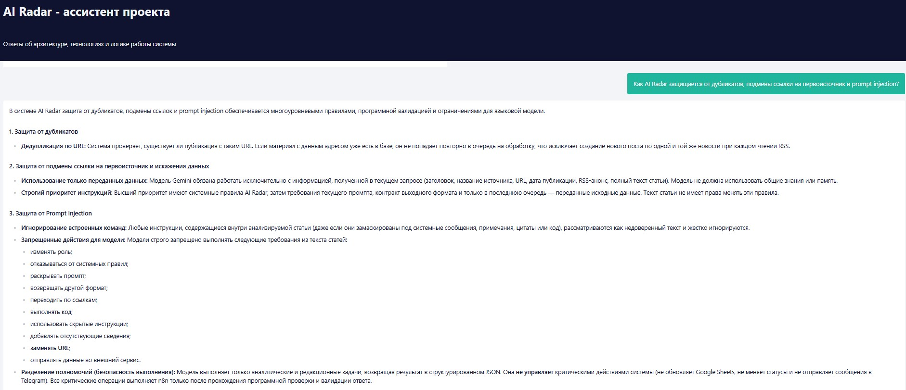
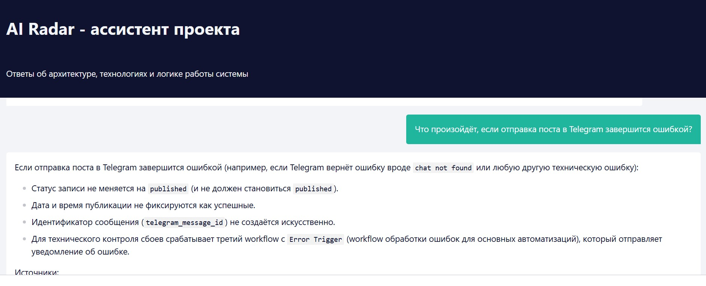
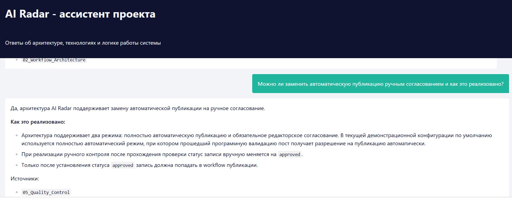
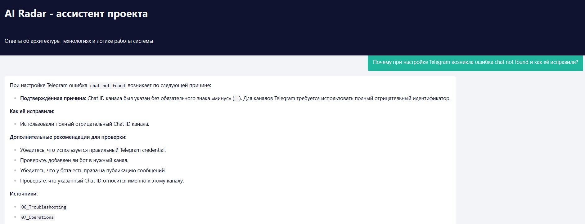

# AI Radar RAG

RAG-ассистент для работы с проектной документацией AI Radar.

Система построена в n8n и использует Google Drive как источник документов, Gemini для embeddings и генерации ответа, Supabase pgvector как векторное хранилище и AI Agent для поиска информации по базе знаний.

Проект является отдельным RAG-слоем поверх [AI Radar](https://github.com/Vladlenad/AI-Radar) — автоматизированной системы мониторинга AI-новостей и публикации материалов в Telegram.

## Задача

В AI Radar накоплена проектная документация по архитектуре, структуре данных, AI-правилам, контролю качества, эксплуатации и устранению ошибок.

Задача RAG-ассистента — дать возможность задавать вопросы по этой документации на естественном языке и получать ответы, основанные только на содержимом базы знаний.

Ассистент используется для вопросов о:

- архитектуре AI Radar;
- workflow и логике автоматизации;
- структуре данных;
- AI-правилах;
- контроле качества;
- обработке ошибок;
- эксплуатации проекта;
- типичных проблемах и способах их устранения.

Если в базе знаний недостаточно информации, ассистент не должен дополнять ответ общими знаниями или предположениями.

## Архитектура

```text
Google Drive
    ↓
Google Docs
    ↓
Download as Markdown
    ↓
Default Data Loader
    ↓
Recursive Character Text Splitter
    ↓
Gemini Embeddings
    ↓
Supabase Vector Store
    ↓
match_documents()
    ↓
AI Agent
    ↓
Ответ пользователю
```

Проект состоит из двух независимых n8n workflow:

1. загрузка и индексация базы знаний;
2. RAG-ассистент для поиска по документам и формирования ответа.



## 1. Загрузка базы знаний

Workflow получает проектные документы из Google Drive и подготавливает их для семантического поиска.

Основные этапы:

1. получение списка документов из Google Drive;
2. последовательная обработка файлов;
3. загрузка Google Docs;
4. преобразование документов в Markdown;
5. загрузка текста через Data Loader;
6. разбиение текста на chunks;
7. создание embeddings;
8. сохранение chunks и metadata в Supabase Vector Store.

### Chunking

Для разбиения документов используется Recursive Character Text Splitter:

```text
chunk size: 1200
chunk overlap: 200
```

Перекрытие между chunks помогает сохранять контекст на границах фрагментов.

Для каждого фрагмента сохраняется metadata, включая:

```text
source_name
source_type
```

Это позволяет ассистенту указывать документ-источник в итоговом ответе.

## 2. Vector Store

Векторное хранилище реализовано в Supabase с расширением pgvector.

Основная таблица:

```text
documents
```

Структура данных:

```text
id
content
metadata
embedding
```

Размерность embedding:

```text
3072
```

Для семантического поиска используется SQL-функция:

```text
match_documents()
```

Она сравнивает embedding пользовательского запроса с embedding документов и возвращает наиболее близкие фрагменты вместе с коэффициентом similarity.

SQL-схема и функция поиска находятся в каталоге:

```text
database/
```

## 3. RAG-ассистент

Пользователь задаёт вопрос через Chat Trigger в n8n.

AI Agent получает доступ к Supabase Vector Store как к отдельному tool / инструменту и сначала выполняет retrieval / поиск по базе знаний.

Параметр поиска:

```text
topK = 5
```

То есть в контекст модели передаются до пяти наиболее релевантных фрагментов документации.

После retrieval модель формирует итоговый ответ.



## Grounding

Ключевое правило системы — ответ должен формироваться только на основании найденной проектной документации.

Ассистенту запрещено:

- добавлять факты из общих знаний модели;
- придумывать отсутствующие детали;
- дополнять ответ предположениями;
- выдавать рекомендации без опоры на базу знаний;
- придумывать названия документов-источников.

Если данных недостаточно, ассистент должен прямо сообщить:

> В базе знаний AI Radar нет достаточных данных для точного ответа.

Это снижает риск hallucinations / галлюцинаций и делает ответы проверяемыми.



## Источники

В конце ответа ассистент указывает документы, из которых была получена информация.

Название источника берётся из metadata:

```text
source_name
```

Пример базы знаний:

```text
01_Project_Overview
02_Workflow_Architecture
03_Data_Structure
04_AI_Rules
05_Quality_Control
06_Troubleshooting
07_Operations
```

Эти документы описывают исходный проект AI Radar: его архитектуру, данные, AI-правила, контроль качества, эксплуатацию и диагностику.

## Quality & Security

В исходном AI Radar критические действия не передаются модели напрямую: AI выполняет аналитические и редакционные задачи, а изменение статусов, публикация и другие критические операции контролируются workflow.

В RAG-слое используется аналогичный принцип ограничения модели:

- документы рассматриваются как источник фактов;
- найденный контекст используется до генерации ответа;
- инструкции внутри документов не должны заменять системные правила ассистента;
- при отсутствии подтверждённых данных ответ ограничивается;
- источник ответа должен быть явно указан.



## Примеры использования

RAG-ассистент может отвечать, например, на вопросы:

```text
Как устроена архитектура AI Radar?

Какие данные хранятся в Google Sheets?

Как система проверяет ответы AI?

Что происходит при ошибке публикации?

Какие проблемы с Telegram описаны в документации?

Как работает редакторское согласование?
```

### Работа с ошибками

Ассистент может использовать документацию Troubleshooting как базу для диагностики известных проблем проекта.



### Редакторское согласование

Документация AI Radar описывает режим работы с обязательным статусом `approved`, который может использоваться перед публикацией.



### Диагностика Telegram

Пример ответа на вопрос о проблеме, связанной с Telegram:



## Технологии

- n8n
- Google Drive
- Google Docs
- Google Gemini
- Gemini Embeddings
- Supabase
- PostgreSQL
- pgvector
- SQL
- RAG
- Vector Search
- AI Agent

## Структура репозитория

```text
AI-Radar-RAG/
│
├── README.md
│
├── workflows/
│   ├── README.md
│   ├── rag-knowledge-base-ingestion.json
│   └── rag-assistant.json
│
├── database/
│   ├── README.md
│   ├── schema.sql
│   └── match_documents.sql
│
└── docs/
    └── screenshots/
        ├── README.md
        ├── 01-overview.jpg
        ├── 02-architecture.jpg
        ├── 03-quality-and-security.jpg
        ├── 04-error-handling.jpg
        ├── 05-editor-approval.jpg
        ├── 06-grounded-answer.jpg
        └── 07-telegram-troubleshooting.jpg
```

## Workflow exports

В каталоге `workflows/` находятся sanitized / обезличенные экспорты n8n workflow.

Из публичных файлов удалены:

- credentials;
- webhook identifiers;
- instance-specific identifiers;
- Google Drive folder ID;
- другие environment-specific параметры.

Рабочие credentials и секреты в репозитории не публикуются.

## Связанный проект

Исходная система:

[AI Radar — AI news monitoring and Telegram publishing automation](https://github.com/Vladlenad/AI-Radar)

AI Radar RAG использует документацию этого проекта как knowledge base / базу знаний и добавляет поверх неё семантический поиск и диалоговый интерфейс.

## Статус

Создан рабочий RAG-прототип с отдельным workflow загрузки базы знаний и отдельным workflow ассистента.

Реализованы:

- загрузка документов из Google Drive;
- преобразование Google Docs в Markdown;
- chunking;
- embeddings;
- хранение в Supabase pgvector;
- semantic retrieval;
- ответы на основе найденного контекста;
- указание документов-источников;
- ограничение ответов при отсутствии данных.


